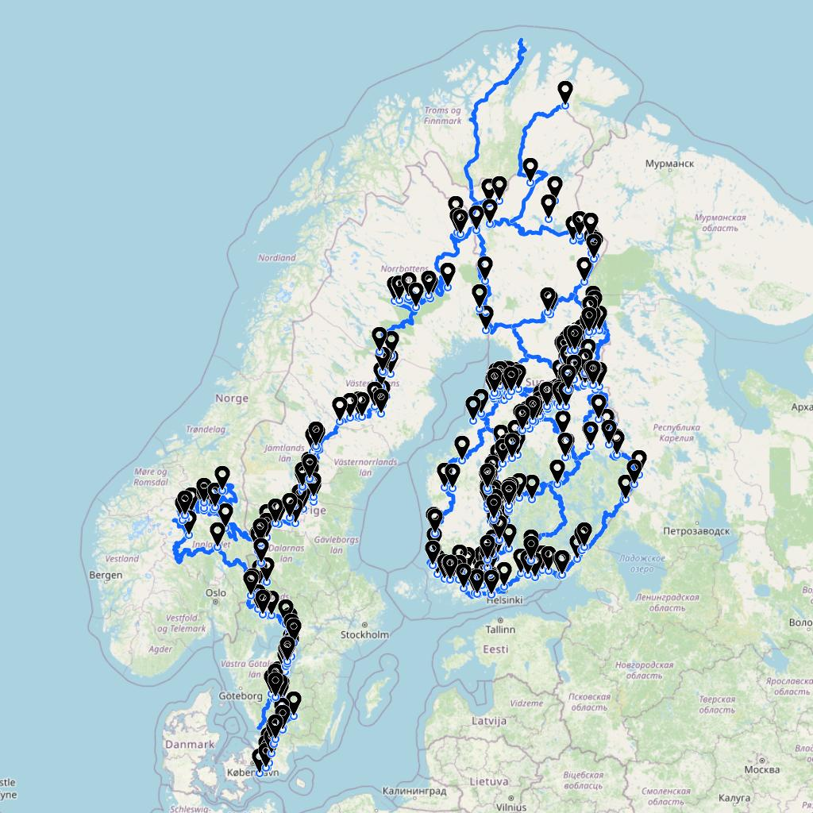
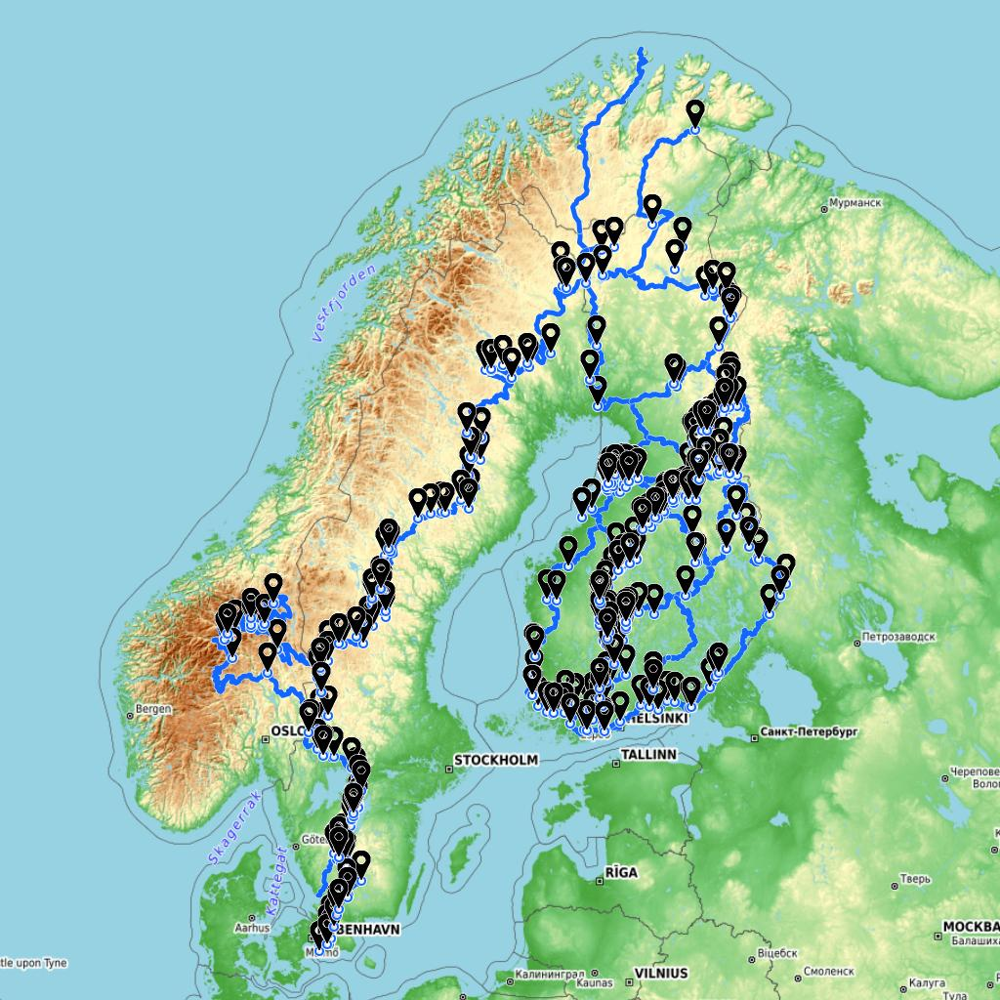
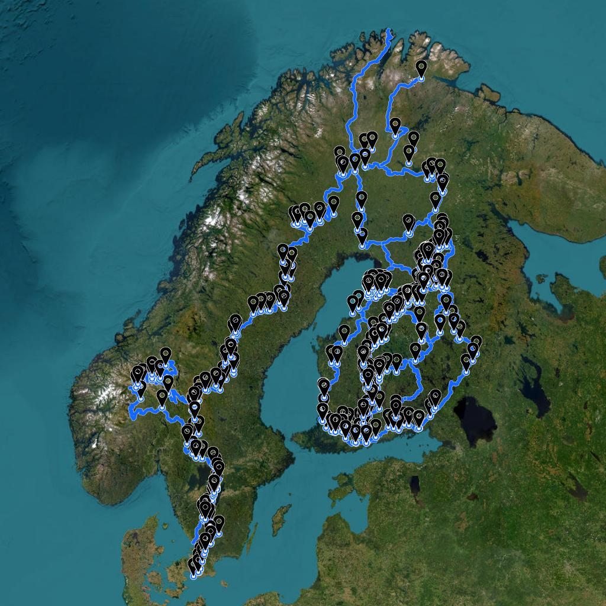
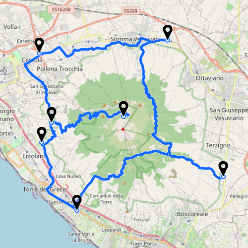

# Georender

Georender is a command line utility for rendering GPS data as image.

Application was created for server side rendering of GPX files for [GPXLAB - GPS Track Editor](https://gpxlab.net).

Following input data formats are supported:
- GeoJSON
- GPX
- KML / KMZ

## Examples
Following images are generated from GPX tracks from [TransEuroTrail](https://transeurotrail.org/) for Finland, Norway and Sweden.

Render GPX on OpenStreetMap

~~~
./georender -w 1024 -h 1024 -i FIN.gpx -i N.gpx -i S.gpx -o samples/1.jpg -t osm
~~~

Render GPX on OpenTopoMap

~~~
./georender -w 1024 -h 1024 -i FIN.gpx -i N.gpx -i S.gpx -o samples/2.jpg -t otm
~~~

Render GPX on ESRI World Imagery

~~~
./georender -w 1024 -h 1024 -i FIN.gpx -i N.gpx -i S.gpx -o samples/3.jpg -t esri
~~~

## How to use it?
Checkout this repository and install dependencies with:
~~~
npm install
~~~

Render sample GPX file with Georender:
~~~
./georender -i samples/vesuvio.gpx -o out.png
~~~

You should get the following image:

## How does it work?
Georender is built with OpenLayers, server side rendering (SSR) is implemented with JSDom.
Application creates a virtual DOM structure to allow OpenLayers render a map. The DOM is monkey patched for missing dependencies to make it work. Once completed the canvas is saved to the output image.

## Options
Georender can be run with following options:
- `-w, --width <px>` - Image width in pixels
- `-h, --height <px>` - Image height in pixels
- `-i, --in <input file>` - Path to input file (.geojson, .gpx, .kml, .kmz), supports multiple files
- `-o, --out <output file>` - Name of the output file (.png, .jpg, .jpeg)
- `-t, --tile <name>` - Name of the tile source (osm, otm, esri)

## Customization
You can change default settings by editing `defaults.js`.

## Notes
- To install Georender on Mac M1 chip you may need to run the following command to install Canvas dependencies:
~~~
brew install pkg-config cairo pango libpng jpeg giflib librsvg
~~~
- OpenLayers may use multiple Canvas elements to render a map, however in tests it seems in Node.js only one Canvas is used so the Renderer code is simplified.
- There seems to be a bug in OpenLayers while importing KMZ resulting in ERR_INVALID_URL while Icon href is being parsed pointing to internals of the ZIP file.

## Credits
- [GPXLAB](https://gpxlab.net)
- [OpenStreetMap](https://www.openstreetmap.org/)
- [OpenTopoMap](https://opentopomap.org/)
- [ESRI World Imagery](https://hub.arcgis.com/datasets/esri::world-imagery/about)
- [OpenLayers](https://github.com/openlayers/openlayers)
- [JSDom](https://github.com/jsdom/jsdom)
- [JSZip](https://github.com/Stuk/jszip)
- [ol-ssr](https://github.com/mmomtchev/ol-ssr)

## License
MIT

